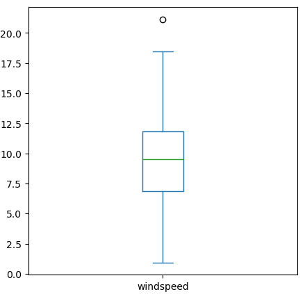
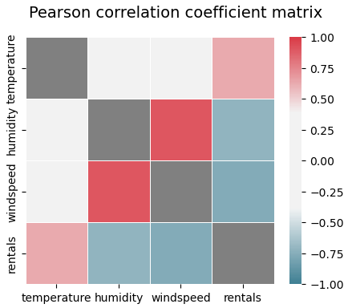
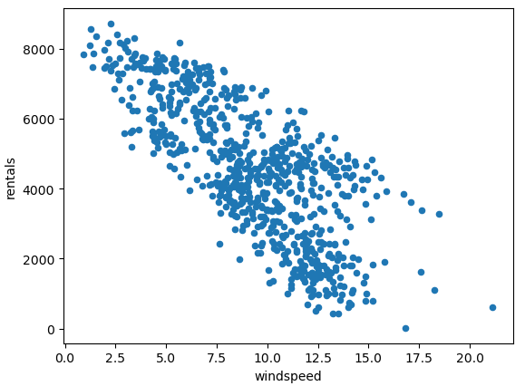
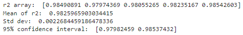
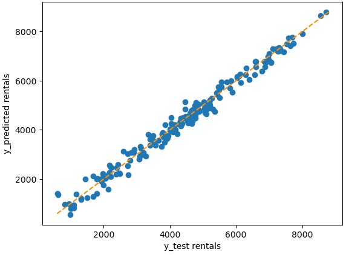
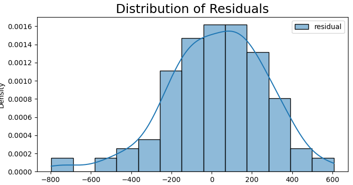
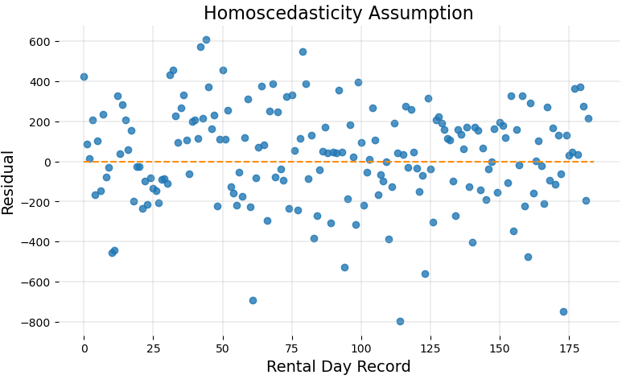
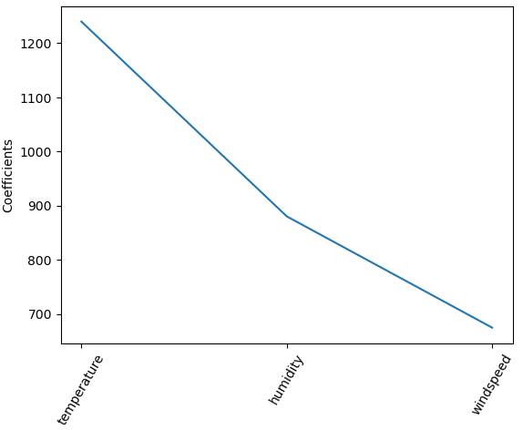

# Weather as a Predictor of Bike Rentals

#### * Please review the [Jupyter Notebook](https://github.com/amjavier/ml_supervised_linearregression_01/blob/master/RegressionModel_LinearRegression_Example.ipynb) file for full details of the analysis. 

### Summary
Explore if a linear regression supervised machine learning model is a good fit to determine if weather is a good predictor of bike rentals in a hypothetical local business.

### Analysis
1. **Data Collection**
   * The dataset was provided in a .csv format. No blanks, duplicates, bad data are present in the data.
   * The initial review of the dataset shows that 'temperature', 'humidity', and 'windspeed' could be used as predictors for the target variable 'rentals'. Since the model achieved a high accuracy score I kept all 3 predictors.
   * Independent variables: temperature, humidity, and windspeed
   * Dependent variable: rentals
2. **Data Exploration**
   * For all 3 independent variables only 1 record for windspeed appears to be an outlier. I did not remove this outlier since the model achieved a high accuracy score.
     * 
   * Lack of Multicollinearity **(Linear Regression Assumption 1 of 5)**: A significant positive association of 0.8988 between the independent (X) variables only exists between windspeed and humidity. The rest of the associations between the independent variables are very weak. Nevertheless, I was able to build an accurate model as will be reflected in the next steps.
     * 
   * Linearity **(Linear Regression Assumption 2a of 5, before running regression)**: All 3 independent variables appear to have a linear tendency.
     * 
3. **Data Preparation**
   * I split the dataset into y (output, target) y and X (input, features) variables. 25% of the full dataset was assigned to the test set.
   * I ran K-fold cross-validation and calculated r2 on the full dataset: The r2 score of 0.9826 means that 98.26% of our target (y-dependent variable) results can be explained by our 3 features (X-independent variables). This result along with a standard deviation of 0.0023 and a 95% confidence interval between 0.9798 and 0.9854 depict a highly accurate model. This accurate r2 score was supported at a later step where I also obtained a highly accurate r2 on the test set (Step 5: Evaluating the ML Model).  
     * 
4. **Training the ML Model**
   * The training dataset was normalized with StandardScaler() in the data preparation section. Lasso regression requires standardizing the target variables so they are treated similarly by the machine learning algorithm.
   * The model was fitted with the training dataset (75% of the full set).
5. **Evaluating the ML Model**
   * I calculated r2 on the test dataset: The r2 score of 0.9821 means that 98.21% of our target (y-dependent variable) results can be explained by our 3 features (X-independent variables) in the test dataset.
   * I calculated the Mean Absolute Error (MAE) to compare predicted values versus the actual values: The results show that the predictions of the model should be off the mark by an average of +/- 194.32.
   * Linearity **(Linear Regression Assumption 2b of 5, after running regression)**: There are appears to be a linear relationship between y_predicted and y_test. This reflects a highly accurate model.
     * 
   * Multivariate Normality **(Linear Regression Assumption 3 of 5)**: The purpose of this step is to check the normality of error distribution. The residuals were normally distributed. Normally distributed residuals support the use of a linear regression model.
     * 
   * Homoscedasticity **(Linear Regression Assumption 4 of 5)**: A uniform variance for the residuals (prediction errors) was true for all data points. The purpose of this graph is to show where residuals tend to concentrate. Residuals (prediction errors) should concentrate around the X-axis and be uniform.
     * 
   * Independence of Observations **(Linear Regression Assumption 5 of 5)**: I checked for no autocorrelation of residuals (errors) over time. The Durbin-Watson result was 1.7822. This means that there is little to no autocorrelation.
   * I used Lasso regression to determine which was the most important predictor. The most important predictor, which is the largest absolute value of the coefficients, was temperature. No features of 0 importance were found.
     * 

### Conclusion
Although the bicycle rental dataset used is small I was able to obtain a high degree of accuracy of over 98% in both the full and test sets. Of course, this high degree of accuracy may not be the case for other datasets as this data was tailored for practicing linear regression. All of the targets were normalized with StandardScaler() since this is required for Lasso regression. Additionally, all 5 assumptions to check the validy of the linear model were satisfied (as noted in steps #1 to #5). Further review of this model and code is required and I don't consider this the final product. But as a general practice of supervised machine learning I think it's a good start.

### Next Steps
* Remove the random_state arguments, deploy model into production, and re-check results.
* Build a dashboard
* Automate the machine learning pipeline  